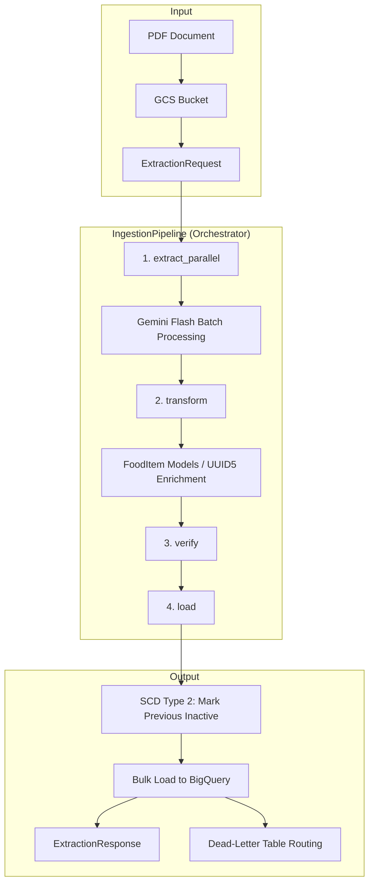

 # SMAE Engine

**Path**: `backend/smae_engine/`

## Overview
The SMAE Engine is responsible for ingesting, processing, and standardizing nutritional data from the *Sistema Mexicano de Alimentos Equivalentes* (SMAE) PDFs. It utilizes Google's Gemini 2.5 Flash via the `google-genai` SDK to perform structured data extraction and persists validated records to BigQuery.

## Architecture
The process follows a two-stage strategy:
1. **Stage 1 (Prototyping)**: Bash scripts manually provision the GCS Bucket (`nutritional-data-sources`) and BigQuery resources. Python scripts extract PDF blobs, pass them to Vertex AI, validate the response, and load records to BigQuery.
2. **Stage 2 (Deployment)**: *(To be implemented)* Terraform codification of resources and Cloud Build pipelines.

### Pipeline Data Flow



### SCD Type 2 Strategy
- **Identity key**: `food_uuid` (deterministic `uuid5(source_uri + food_name)`).
- **On re-ingestion**: a DML `UPDATE` sets `active = False` for all rows with matching `food_uuid` before the new batch is inserted.
- **Partition key**: `ingested_at` (DAY-level partitioning for cost-efficient time-scoped queries).

## Folder Structure
All application logic is modularized into specialized services:
- `source_code/main.py`: Thin orchestrator (`IngestionPipeline`).
- `source_code/config.py`: Centralized configuration.
- `source_code/schemas.py`: Orchestrator-level schemas and service re-exports.
- `source_code/gcs_service/`: Handles bucket validation, MIME resolution, and PDF downloads.
- `source_code/gemini_service/`: Encapsulates Vertex AI Gemini extraction, transformation, and verification.
- `source_code/bq_service/`: Manages BigQuery persistence, SCD Type 2 logic, and dead-letter routing.

## Schemas

Schemas are organized by service but re-exported from `source_code/schemas.py` for backward compatibility. All models are fully typed using `Pydantic` and `Annotated`.

### FoodItem
Core nutritional record. Includes 11 nutritional columns plus `food_uuid` and `ingested_at`.

### FoodEquivalentRow *(inherits FoodItem)*
BigQuery row schema for `nutrimental_information.food_equivalents`. Adds two columns:

| Column | BQ Type | Mode | Notes |
|---|---|---|---|
| `source_uri` | `STRING` | REQUIRED | GCS URI of the originating PDF |
| `active` | `BOOLEAN` | REQUIRED | SCD Type 2 lifecycle flag |

### LoadResponse
Result of the `load()` method: `rows_inserted`, `rows_failed`, `dead_letter_rows`.

## BigQuery Resources

| Resource | Full ID |
|---|---|
| Main table | `<project>.nutrimental_information.food_equivalents` |
| Dead-letter table | `<project>.nutrimental_information.food_equivalents_dead_letter` |

### Dead-Letter Table Schema
| Column | Type | Description |
|---|---|---|
| `source_uri` | STRING | Origin PDF URI |
| `food_uuid` | STRING | UUID of the failed row |
| `raw_row` | STRING | JSON-serialised row |
| `error_message` | STRING | Failure reason |
| `failed_at` | TIMESTAMP | UTC timestamp of failure |

## Configuration

The pipeline is configured via environment variables, split into three functional groups to allow granular control over each service.

### GCS Service (`GcsSettings` — env prefix `SMAE_GCS_`)

| Env Var | Default | Description |
|---|---|---|
| `SMAE_GCS_TRUSTED_BUCKET` | `nutritional-data-sources` | Allowed GCS bucket name |
| `SMAE_GCS_MAX_FILE_SIZE_MB` | `20` | Max PDF size for MIME resolution |
| `SMAE_GCS_MAX_SOURCE_PDF_SIZE_MB` | `50` | Max source PDF size before download |

### Gemini Service (`GeminiSettings` — env prefix `SMAE_GEMINI_`)

| Env Var | Default | Description |
|---|---|---|
| `SMAE_GEMINI_MODEL` | `gemini-2.5-flash` | Gemini model identifier |
| `SMAE_GEMINI_GCP_LOCATION` | `us-central1` | GCP region for Vertex AI |
| `SMAE_GEMINI_BATCH_SIZE` | `5` | Pages per parallel extraction batch |
| `SMAE_GEMINI_MAX_PARALLEL_WORKERS` | `10` | Max concurrent Gemini batch calls |
| `SMAE_GEMINI_MAX_RETRIES` | `3` | Max retries on Gemini ResourceExhausted |
| `SMAE_GEMINI_RETRY_BASE_DELAY_S` | `5.0` | Base retry delay in seconds |
| `SMAE_GEMINI_RETRY_MAX_DELAY_S` | `60.0` | Max retry delay cap in seconds |

### BigQuery Service (`BqSettings` — env prefix `SMAE_BQ_`)

| Env Var | Default | Description |
|---|---|---|
| `SMAE_BQ_PROJECT` | *(from ADC)* | GCP project for BQ writes; resolved from ADC when unset |
| `SMAE_BQ_DATASET` | `nutrimental_information` | BigQuery dataset containing the food equivalents table |
| `SMAE_BQ_TABLE` | `food_equivalents` | BigQuery table for food items |
| `SMAE_BQ_DEAD_LETTER_TABLE` | `food_equivalents_dead_letter` | BigQuery dead-letter table for failed row inserts |
| `SMAE_BQ_BATCH_SIZE` | `500` | Max rows per load_table_from_json batch job |

## Usage
To create sandbox resources (GCS + BigQuery):
```bash
./backend/smae_engine/source_code/create_resources.sh
```
To tear down sandbox resources:
```bash
./backend/smae_engine/source_code/delete_resources.sh
```
To run locally:
```bash
make run-smae-engine
```
