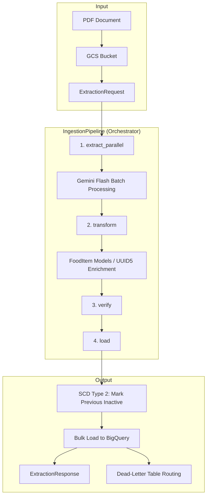

# SMAE Engine

**Path**: `backend/smae_engine/`

## Overview
The SMAE Engine is responsible for ingesting, processing, and standardizing nutritional data from the *Sistema Mexicano de Alimentos Equivalentes* (SMAE) PDFs. It utilizes Google's Gemini 2.5 Flash via the `google-genai` SDK to perform structured data extraction and persists validated records to BigQuery.

## Architecture
The engine follows a two-stage development strategy:
1. **Stage 1 (Prototyping)**: Logic was verified via Jupyter Notebooks using manual infrastructure scripts.
2. **Stage 2 (Deployment)**: The engine is deployed as a **Cloud Run v2** service using **FastAPI** and **Uvicorn**. Infrastructure is fully codified via Terraform (CFF).

### Pipeline Data Flow



### SCD Type 2 Strategy
- **Identity key**: `food_uuid` (deterministic `uuid5(source_uri + food_name)`).
- **On re-ingestion**: a DML `UPDATE` sets `active = False` for all rows with matching `food_uuid` before the new batch is inserted.
- **Partition key**: `ingested_at` (DAY-level partitioning for cost-efficient time-scoped queries).

## Execution Patterns

The SMAE Engine supports two primary execution modes:

### 1. Cloud Run API (Service Mode)
When deployed to Cloud Run, the engine acts as an HTTP server listening on port 8080.
- **Framework**: FastAPI + Uvicorn (ASGI).
- **Endpoint**: `POST /`
- **Payload**: `ExtractionRequest` (JSON).

### 2. Local CLI (Batch Mode)
The engine can be executed directly from the terminal for local testing or batch processing without starting the web server.
- **Entry Point**: `backend.smae_engine.source_code.main`
- **Pattern**: `python -m <module> <gcs_uri>`

## Folder Structure
All application logic is modularized into specialized services:
- `source_code/main.py`: Dual-mode entry point (FastAPI + CLI).
- `source_code/pipeline.py`: Core orchestrator (`IngestionPipeline`).
- `source_code/config.py`: Centralized configuration via Pydantic Settings.
- `source_code/schemas.py`: Shared Pydantic models.
- `source_code/gcs_service/`: GCS operations and PDF handling.
- `source_code/gemini_service/`: Vertex AI extraction logic.
- `source_code/bq_service/`: BigQuery persistence and SCD Type 2.

## Deployment Details

| Resource | Value |
|---|---|
| **Platform** | Cloud Run v2 |
| **Region** | `us-central1` |
| **RAM** | 1024 MiB |
| **CPU** | 1 |
| **Scaling** | min: 0, max: 1 (Scale-to-zero enabled) |
| **Auth** | Unauthenticated (for development) |

## Usage

### Local CLI Execution
To run the extraction pipeline locally against a GCS file:
```bash
# Using uv (recommended)
uv run --group smae python -m backend.smae_engine.source_code.main gs://your-bucket/document.pdf

# Using standard python
export PYTHONPATH=$PYTHONPATH:.
python -m backend.smae_engine.source_code.main gs://your-bucket/document.pdf
```

### Local API Execution
To start the FastAPI server locally:
```bash
uv run --group smae python -m backend.smae_engine.source_code.main
```
Then send a request:
```bash
curl -X POST http://localhost:8080/ \
  -H "Content-Type: application/json" \
  -d '{"gcs_uri": "gs://your-bucket/document.pdf"}'
```

### Cloud Run Execution
Send a request to the deployed service URL:
```bash
curl -X POST https://smae-engine-<hash>-uc.a.run.app/ \
  -H "Content-Type: application/json" \
  -d '{"gcs_uri": "gs://your-bucket/document.pdf"}'
```
