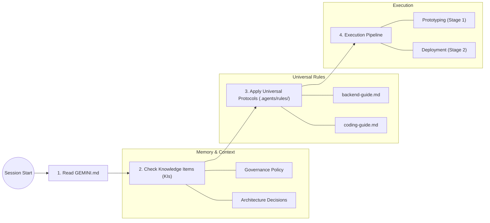

# Agent Memory & Development Protocols

This document explains how the AI coding assistant (Antigravity) maintains context, remembers architectural decisions, and enforces development protocols across different sessions and iterations.

## 1. The Context Hierarchy

The agent operates using three layers of information, prioritized from static rules to project-specific "wisdom".

## 2. How "Memory" Works

The agent uses **Knowledge Items (KIs)** as its long-term repository memory.

- **Location**: `~/.gemini/antigravity/knowledge/`
- **Persistence**: Unlike conversation history, KIs are permanent and associated with this specific repository.
- **Activation**: At the start of every session, the agent is instructed to scan the `knowledge/` directory for summaries that match the current task.

## 3. Mandatory Development Protocols

Every task in the Nutritional Partner project MUST follow the standardized lifecycle:

1. **Discovery (architecture-planning)**: Mandatory Q&A and Q&A session.
2. **Prototyping (prototyping-logic)**: Logic development in `/source_code` and verification in `/notebooks`.
3. **Security (security-audit)**: Zero-tolerance for high-risk vulnerabilities.
4. **Deployment (deployment)**: Final codification in Terraform and Cloud Build triggers.

## 4. How to Modify the System

### Modifying Universal Rules
To change how the agent behaves globally (e.g., changing the Pydantic validation rules), modify the files in:
- `.agents/rules/*.md`

### Modifying Project Memory
To record a new architectural decision or a domain-specific pattern:
1. Ask the agent to "create a new Knowledge Item (KI)" for the specific decision.
2. The agent will write a new entry to the `knowledge/` directory.
3. This information will be automatically retrieved in future conversations.

### Modifying the Pipeline
To change the mandatory sequence of execution, update:
- `GEMINI.md`

---

## 5. Memory System Standards & Foundations

The agent's memory architecture is built upon the following core AI engineering principles:

- **Persistent Context (RAG)**: The Knowledge Item (KI) system is a localized implementation of **Retrieval-Augmented Generation**. This allows the agent to retrieve relevant project-specific context (architectural decisions, rules) without needing to be retrained on the codebase. [RAG Overview](https://en.wikipedia.org/wiki/Retrieval-augmented_generation)
- **Knowledge Item (KI) Schema**: Every memory entry follows a standardized structure (`metadata.json`, `artifacts/`, `timestamps.json`) designed for deterministic retrieval and human-auditability.
- **Context Injection**: During the "Discovery Phase", the agent's system prompt mandates a scan of the `~/.gemini/antigravity/knowledge/` directory, which injects project-specific constraints into the active reasoning window.
